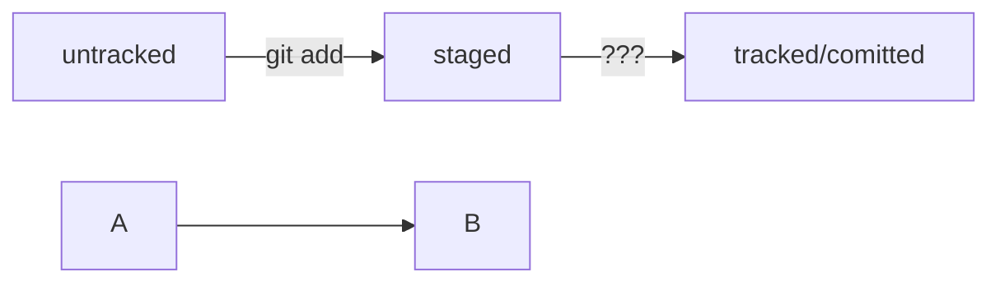

# Git Assistant


## В этом пособии я помогу тебе понять основы Git и GitHub


*Ты готов?*

### Шпаргалка по командной строке
- `pwd` (от англ. ***p**rint **w**orking **d**irectory*, «показать рабочую папку») — покажи, в какой я папке;
- `ls` (от англ. ***l**i**s**t directory contents*, «отобразить содержимое директории») — покажи файлы и папки в текущей папке;
- `ls -a` — покажи также скрытые файлы и папки, названия которых начинаются с символа `.`;
- `cd first-project` (от англ. ***c**hange **d**irectory*, «сменить директорию») — перейди в папку `first-project`;
- `cd first-project/html` — перейди в папку `html`, которая находится в папке `first-project`;
- `cd ..` — перейди на уровень выше, в родительскую папку;
- `cd ~` — перейди в домашнюю директорию (`/Users/Username`);
- `cd /` — перейди в корневую директорию.

### Работа с файлами и папками

**Создание**

- `touch index.html` (англ. *touch,* «коснуться») — создай файл `index.html` в текущей папке;
- `touch index.html style.css script.js` — если нужно создать сразу несколько файлов, можно напечатать их имена в одну строку через пробел;
- `mkdir second-project` (от англ. ***m**a**k**e **dir**ectory*, «создать директорию») — создай папку с именем `second-project` в текущей папке.

**Копирование и перемещение**

- `cp file.txt ~/my-dir` (от англ. ***c**o**p**y*, «копировать») — скопируй файл в другое место;
- `mv file.txt ~/my-dir` (от англ. ***m**o**v**e*, «переместить») — перемести файл или папку в другое место.
- `clip < путь_к_файлу` скопировать содержимое ключа в буфер обмена

**Чтение**

- `cat file.txt` (от англ. *con**cat**enate and print*, «объединить и распечатать») — распечатай содержимое текстового файла `file.txt`.

**Удаление**

- `rm about.html` (от англ. ***r**e**m**ove*, «удалить») — удали файл `about.html`;
- `rmdir images` (от англ. ***r**e**m**ove **dir**ectory*, «удалить директорию») — удали папку `images`;
- `rm -r second-project` (от англ. ***r**e**m**ove,* «удалить» + ***r**ecursive*, «рекурсивный») — удали папку `second-project` и всё, что она содержит.

### Полезные возможности

- Команды необязательно печатать и выполнять по очереди. Можно указать их списком — разделить двумя амперсандами (`&&`).
- У консоли есть собственная память — буфер с несколькими последними командами. По ним можно перемещаться с помощью клавиш со стрелками вверх (**`↑`**) и вниз (**`↓`**).
- Чтобы не вводить название файла или папки полностью, можно набрать первые символы имени и дважды нажать `Tab`. Если файл или папка есть в текущей директории, командная строка допишет путь сама.

---

### Что такое Git?


**Git** - это система контроля версий, которая помогает отслеживать изменения в проекте. Этот инструмент можно использовать как для индивидуальной, так и для командной работы.
Git позволяет сохранять изменения локально и при необходимости возвращаться к предыдущим версиям проекта. Также можно создать удалённую копию на хостинг-платформе, которая работает с Git, и поделиться результатом с другими.

### Оснонывные этапы 


1. Создаем папку, в которой будет находится наш проект


2. Чтобы Git начал отслеживать изменения в проекте, папку с файлами этого проекта нужно сделать Git-репозиторием (от англ. repository — «хранилище»). Для этого следует переместиться в неё и ввести команду ```git init```.


2.1 Если вы случайно сделали Git-репозиторием не ту папку, её можно «разгитить». Для этого нужно удалить скрытую подпапку `.git`.
```
$ cd <папка с репозиторием> # перешли в папку
$ rm -rf .git # удалили подпапку .git
```

3. После инициализации репозитория запустите команду ```git status``` (от англ. status — «статус», «состояние») — она показывает текущее состояние репозитория.


4. После подготавливаем файл к сохранению с помощбю команды ``` git add --all | git add название_файла | git add . (добавить всю текущую папку)```


5. Создаем commit, который гарантирует, что изменения будут сохранены в истории и при необходимости к ним можно будет «откатиться», с помощью команды ```git commit -m 'Сообщение о коммите'```

6. Чтобы увидеть все коммиты, введите команду ```git log``` (от англ. *log* — «журнал [записей]»).

Обратите внимание, что по умолчанию ```git log``` выводит коммиты в обратном хронологическом порядке — последние коммиты оказываются первыми сверху. В этом можно убедиться, если посмотреть на дату и время их создания.

7. Связать локальный и удаленный репозиторий 

### Привязать удалённый репозиторий к локальному — `git remote add`

	
Перейдите на страницу удалённого репозитория, выберите тип SSH и скопируйте URL. Кнопка справа позволит сделать это мгновенно.


Откройте консоль, перейдите в каталог локального репозитория и введите команду `git remote add` (от англ. *remote* — «удалённый» и *add* — «добавить»).

```bash
$ cd ~/dev/first-project
$ git remote add origin git@github.com:%ИМЯ_АККАУНТА%/first-project.git
```

Команде необходимо передать два параметра: имя удалённого репозитория и его URL. В качестве имени используйте слово `origin`. А URL вы скопировали со страницы удалённого репозитория.


Убедиться, что репозитории связаны, — git remote -v

```bash
$ git remote -v
origin    git@github.com:%ИМЯ_АККАУНТА%/%ИМЯ-ПРОЕКТА%.git (fetch)
origin    git@github.com:%ИМЯ_АККАУНТА%/%ИМЯ-ПРОЕКТА%.git (push)
```

В выводе вы должны увидеть две строчки, аналогичные тем, что показаны выше.

Флаг `-v` — короткая форма флага `--verbose` (англ. «подробный»). Он позволяет показать больше информации в выводе.


# Синхронизируем локальный и удалённый репозитории
Самая первая ветка в репозитории появляется автоматически и называется `main` (англ. «основная») или `master`. Её имя нужно указывать при отправке коммитов на удалённый репозиторий или при получении их из него.

### Отправить изменения на удалённый репозиторий — `git push`

Вы уже прошли весь «цикл коммита»: подготовили файлы с помощью `git add`, закоммитили их с комментарием командой `git commit -m`. Осталось загрузить содержимое локального репозитория на GitHub. За это отвечает команда `git push` (от англ. *push* — «толкать»).

В первый раз эту команду нужно вызвать с флагом `-u` и параметрами `origin` (имя удалённого репозитория) и `main` или `master` (название текущей ветки). Флаг `-u` свяжет локальную ветку с одноимённой удалённой. Как вы связывали локальный и удалённый репозитории в предыдущем уроке, так же и здесь нужно дополнительно связать ветки.

```bash
$ git push -u origin main # Если команда приведёт к ошибке, попробуйте
                          # заменить main на master.
```

В дальнейшем при работе с удалённым репозиторием флаг `-u` можно опустить и писать просто `git push`.


Head -- это голова.
Коммит -- это всему голова.
Статусы файла:


